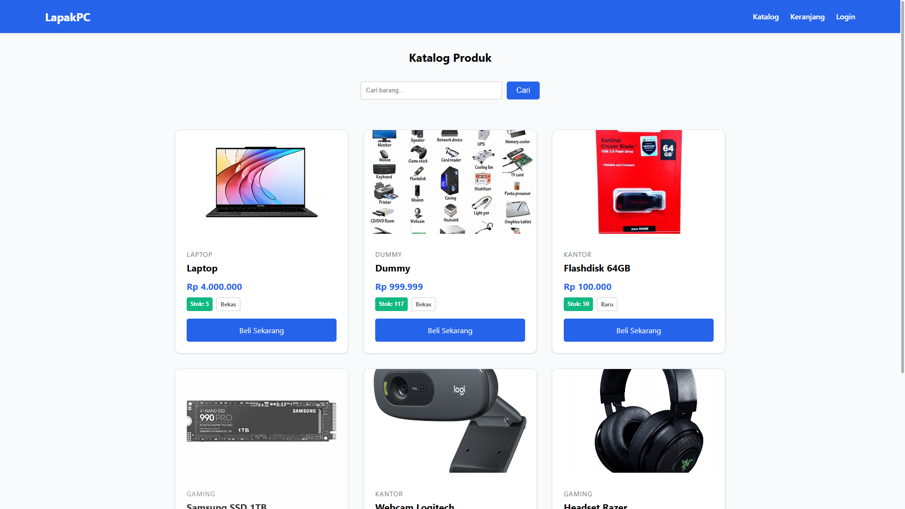
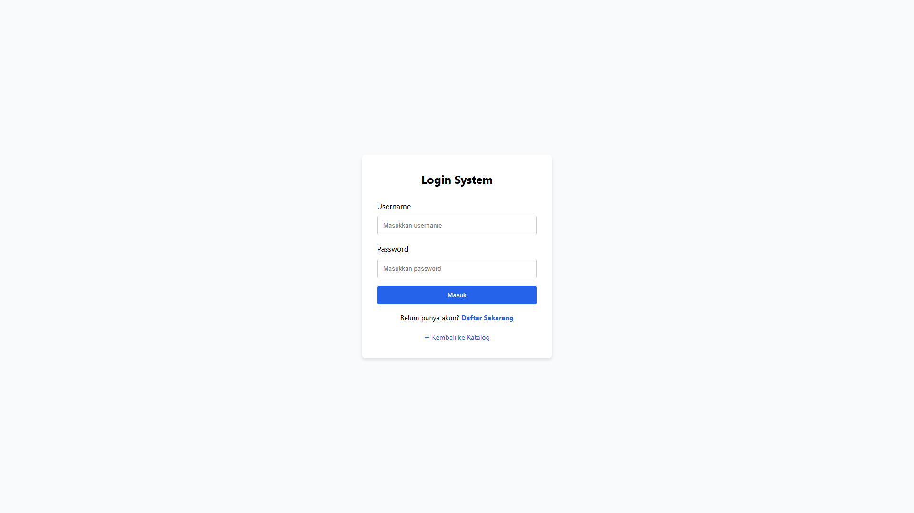
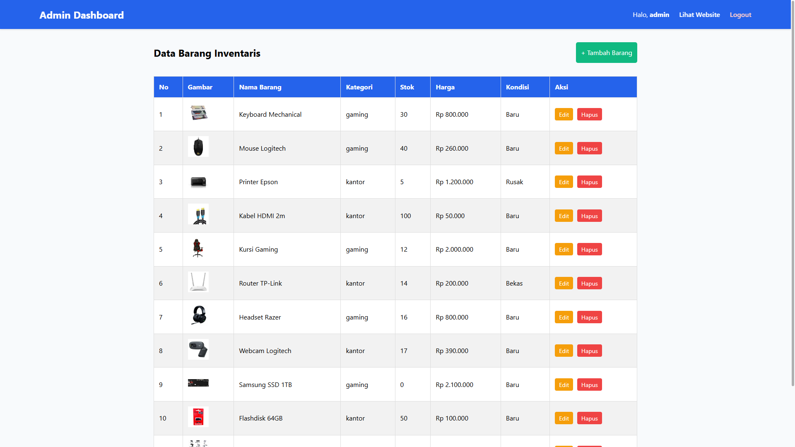
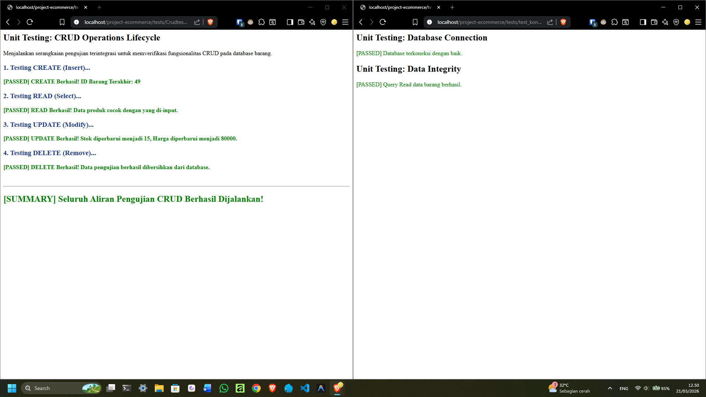

# LapakPC — Sistem Informasi E-Commerce Perangkat Keras Komputer

LapakPC adalah aplikasi web berbasis PHP Native yang dirancang untuk memfasilitasi katalogisasi, manajemen inventaris, dan simulasi pembelian perangkat keras (hardware) komputer secara teratur dan efisien. Aplikasi ini mengelola katalog produk secara real-time, sistem keranjang belanja berbasis session untuk pelanggan, proses checkout yang aman, serta dashboard admin interaktif untuk operasi manajemen inventaris (stok dan lokasi rak). Tujuan pembelajaran dan produksi dari aplikasi ini adalah sebagai sarana digitalisasi toko komputer konvensional, serta sebagai implementasi komprehensif dari sistem web full-stack dengan operasi CRUD yang aman, kontrol sesi pelanggan dan admin, penanganan transaksi database dengan pencegahan race condition, serta perlindungan terhadap celah SQL Injection dan XSS.



---

## 🛠️ Tech Stack & Tooling

- **Backend:** PHP Native (Minimal PHP 8.1+)
- **Frontend:** HTML5 Semantik, CSS3 (CSS Grid, Flexbox, Custom CSS Variables), JavaScript (Vanilla ES6)
- **Database:** MySQL (Minimal 5.7+) / MariaDB (Minimal 10.3+)
- **Tooling & Environment:**
  - Laragon atau XAMPP (Apache & MySQL local server environment)
  - Git (Version Control System)

---

## 🚀 Panduan Instalasi & Menjalankan Aplikasi

Berikut adalah panduan lengkap agar siapa pun (bahkan yang belum pernah melihat kode ini sebelumnya) dapat menjalankan aplikasi di lingkungan lokal.

### 1. Persiapan Kebutuhan Sistem
Pastikan perangkat Anda telah terinstal:
- Server lokal seperti Laragon atau XAMPP (dengan PHP 8.1+ dan MySQL)
- Git (untuk cloning repository)

### 2. Clone Repository
Buka terminal atau command prompt, navigasikan ke direktori web server Anda (contoh: `www` untuk Laragon atau `htdocs` untuk XAMPP), lalu jalankan:
```bash
git clone https://github.com/MuhammadRadzi/project-ecommerce.git project-ecommerce
cd project-ecommerce
```

### 3. Setup & Migrasi Database
1. Pastikan Apache dan MySQL di Laragon/XAMPP sudah berjalan.
2. Buka phpMyAdmin di browser Anda (biasanya `http://localhost/phpmyadmin`).
3. Buat database baru bernama `db_ecommerce` dengan mengeksekusi kueri berikut:
   ```sql
   CREATE DATABASE db_ecommerce;
   ```
4. Impor tabel dan data awal dengan menjalankan kueri SQL berikut di tab SQL phpMyAdmin Anda:
   ```sql
   CREATE TABLE barang (
       id_barang INT PRIMARY KEY AUTO_INCREMENT,
       nama_barang VARCHAR(255) NOT NULL,
       jenis_barang VARCHAR(100) NOT NULL,
       stok INT NOT NULL DEFAULT 0,
       harga DECIMAL(10,2) NOT NULL,
       kondisi ENUM('Baru', 'Bekas', 'Rusak') NOT NULL,
       lokasi_rak VARCHAR(10) DEFAULT NULL,
       gambar VARCHAR(255) DEFAULT 'no-image.jpg',
       created_at TIMESTAMP DEFAULT CURRENT_TIMESTAMP
   ) ENGINE=InnoDB DEFAULT CHARSET=utf8mb4;

   CREATE TABLE users (
       id INT PRIMARY KEY AUTO_INCREMENT,
       username VARCHAR(50) UNIQUE NOT NULL,
       password VARCHAR(255) NOT NULL,
       role ENUM('admin', 'user') DEFAULT 'user',
       created_at TIMESTAMP DEFAULT CURRENT_TIMESTAMP
   ) ENGINE=InnoDB DEFAULT CHARSET=utf8mb4;

   -- Seeding data admin default (Password: admin123)
   INSERT INTO users (username, password, role) VALUES 
   ('admin', '$2y$12$fOgM7iVi75yGsxwaSMbti.HNbW/EiZ36Fvr3pZm.VGyCzNWZYwjgC', 'admin');

   -- Seeding data user default (Password: user123)
   INSERT INTO users (username, password, role) VALUES 
   ('user', '$2y$12$Nq7qG7y5Yf8vN75JpB6vEexP4fL3F6fX/aX.U4fNfO4sK2bI7d7Yy', 'user');

   -- Seeding data barang awal
   INSERT INTO barang (nama_barang, jenis_barang, stok, harga, kondisi, lokasi_rak, gambar) VALUES
   ('Processor AMD Ryzen 5 5600X', 'Processor', 15, 2300000.00, 'Baru', 'A-01', 'no-image.jpg'),
   ('Nvidia RTX 4060 Ti 8GB', 'VGA Card', 8, 6500000.00, 'Baru', 'A-02', 'no-image.jpg'),
   ('RAM Corsair Vengeance LPX DDR4 16GB', 'RAM', 25, 650000.00, 'Baru', 'B-01', 'no-image.jpg'),
   ('SSD Samsung 980 Pro NVMe 1TB', 'Storage', 12, 1450000.00, 'Baru', 'B-02', 'no-image.jpg'),
   ('Power Supply Corsair RM750x Gold', 'Power Supply', 5, 1850000.00, 'Baru', 'C-01', 'no-image.jpg');
   ```

### 4. Konfigurasi Environment Sesi database
Buka file `config/database.php` dan sesuaikan dengan kredensial database lokal Anda (secara default di Laragon/XAMPP, gunakan username `root` dengan password dikosongkan):
```php
$host = "localhost";
$user = "root";
$pass = "";
$db   = "db_ecommerce";
```

### 5. Jalankan Tes Otomatis (Unit Testing)
Untuk memverifikasi koneksi database dan integritas fungsionalitas CRUD secara instan, buka tautan pengujian berikut di browser Anda:
- Cek Koneksi & Pengambilan Data: `http://localhost/project-ecommerce/tests/test_koneksi.php`
- Cek Alur CRUD Lengkap: `http://localhost/project-ecommerce/tests/CrudTest.php`

*(Jika unit testing sukses menampilkan status **[PASSED]**, sistem Anda siap digunakan!)*

### 6. Menjalankan Aplikasi
Buka browser dan akses aplikasi melalui URL:
```
http://localhost/project-ecommerce
```
Gunakan kredensial default berikut untuk login awal:
- **Untuk Admin:**
  - **Username:** `admin`
  - **Password:** `admin123`
- **Untuk Pelanggan (User biasa):**
  - **Username:** `user`
  - **Password:** `user123`



---

## 📝 Pemetaan Rubrik Penilaian

Aplikasi LapakPC dibangun dengan memperhatikan best practices pengembangan web, mencakup elemen-elemen berikut:

- **HTML Semantik & Struktur:** Penggunaan tag `<header>`, `<nav>`, `<main>`, `<section>`, `<article>`, `<figure>`, dan `<footer>` diimplementasikan dengan sangat baik pada katalog utama (`index.php`) untuk aksesibilitas, SEO, dan penataan struktur dokumen yang rapi.
- **Responsivitas:** Antarmuka disesuaikan dengan teknik responsif, menggunakan CSS Grid, Flexbox, media query CSS3, dan variabel warna terpusat di `assets/css/style.css` agar nyaman diakses melalui ponsel, tablet, maupun desktop.
- **Validasi Input:** Terdapat validasi dua lapis. Pada sisi klien menggunakan atribut HTML5 (`required`, `pattern` lokasi rak, batas ukuran 2MB, dsb.) dan perlindungan konfirmasi keluar halaman sebelum data disimpan di `admin/products/add.php`. Pada sisi server menggunakan fungsi sanitasi data `input()` (`htmlspecialchars()` dan `mysqli_real_escape_string()`) di `config/database.php` untuk memfilter input data.
- **Operasi CRUD:** Diimplementasikan secara penuh pada modul manajemen produk inventaris (dashboard utama di `admin/index.php`, form tambah produk di `admin/products/add.php`, form ubah data dengan input terisi otomatis di `admin/products/edit.php`, serta penghapusan aman produk beserta file gambar fisiknya di `admin/products/delete.php`).
- **Autentikasi & Keamanan:** Menggunakan enkripsi kata sandi satu arah `password_hash()` (bcrypt) untuk registrasi pengguna di `register.php`, manajemen sesi PHP untuk kontrol hak akses halaman, serta implementasi *Role-Based Access Control* (RBAC) dinamis antara Admin dan User biasa. SQL Injection dicegah total menggunakan *Prepared Statements* di seluruh kueri database penting (seperti di `includes/functions.php` dan `auth/login_process.php`).
- **Integritas Transaksi Database:** Proses checkout belanja di `includes/functions.php` menggunakan transaksi database ACID (`mysqli_begin_transaction`) dan penguncian baris (`SELECT FOR UPDATE`) pada stok produk untuk menjamin data stok selalu konsisten saat terjadi transaksi checkout konkuren.

> **Mengapa Operasi CRUD Penting dalam Aplikasi Web?**
> CRUD (Create, Read, Update, Delete) adalah fungsionalitas inti dari hampir seluruh aplikasi dinamis. CRUD menjadi jembatan bagi pengguna untuk berinteraksi dengan basis data secara interaktif. Tanpa CRUD, aplikasi hanyalah brosur statis yang tidak bisa menerima atau mengolah informasi baru. Dalam konteks aplikasi LapakPC, proses CRUD memastikan data produk di toko, stok inventaris, penambahan item keranjang, dan manajemen data pengguna selalu relevan, akurat, dan dapat diperbarui secara waktu nyata. Ini merepresentasikan interaksi sistem informasi pada dunia bisnis nyata seutuhnya.



---

## 📁 Struktur Direktori & Alur Data

Proyek ini tidak menggunakan framework MVC murni, melainkan menerapkan pola pemisahan logika bisnis (*Process/Controller*), konfigurasi database (*Model*), dan antarmuka (*View*) agar mudah dipelihara.

**Struktur Direktori Singkat:**
```
project-ecommerce/
├── admin/                     # Modul Admin
│   ├── index.php              # Dashboard inventaris admin (Read)
│   ├── products/
│   │   ├── add.php            # Form tambah barang baru (Create - View)
│   │   ├── edit.php           # Form ubah data barang (Update - View)
│   │   └── delete.php         # Logika penghapusan barang (Delete - Controller)
├── assets/                    # Asset statis frontend
│   ├── css/
│   │   └── style.css          # CSS utama & variabel desain
│   ├── img/
│   │   └── products/          # Direktori unggah gambar produk fisik
├── auth/                      # Modul autentikasi & sesi
│   ├── login_process.php      # Verifikasi login & hak akses
│   ├── logout.php             # Penghapusan sesi pengguna
│   └── register_process.php   # Registrasi pengguna baru
├── config/                    # Konfigurasi Inti
│   └── database.php           # Koneksi MySQL, helper Rupiah, sanitasi input
├── includes/                  # Fungsi Logika & Desain Layout
│   ├── functions.php          # Kueri terproteksi & penanganan stok
│   └── navigation.php         # Navbar dinamis
├── process/                   # Modul Pemrosesan Form CRUD Admin
│   ├── product_add.php        # Pemrosesan tambah barang
│   └── product_edit.php       # Pemrosesan edit barang
├── public/                    # Logika pelanggan umum
│   └── checkout.php           # Pemrosesan transaksi checkout
├── tests/                     # Unit Testing
│   ├── CrudTest.php           # Uji coba siklus lengkap CRUD
│   └── test_koneksi.php       # Uji coba koneksi database
├── index.php                  # Halaman Katalog Utama (View)
├── beli.php                   # Tambah item ke keranjang belanja
├── keranjang.php              # Halaman Keranjang Belanja Pelanggan (View)
├── login.php                  # Halaman Login Pengguna (View)
└── register.php               # Halaman Pendaftaran Akun Pelanggan (View)
```

**Alur Data Aplikasi (Contoh: Tambah Produk Baru):**
1. **Request** dari admin di-routing ke `admin/products/add.php` (View) untuk menampilkan form input produk baru.
2. **Validasi Klien** memvalidasi tipe berkas foto, ukuran maksimal 2MB, serta format isian teks dan angka sebelum disubmit.
3. **Controller/Logic** di `process/product_add.php` menerima POST data, menyaringnya menggunakan fungsi `input()`, memvalidasi ukuran & ekstensi gambar, lalu menyimpan gambar fisik ke dalam `assets/img/products/`.
4. **Interaksi Database** dipanggil via koneksi database `config/database.php` menggunakan *SQL Prepared Statement* untuk mengamankan query INSERT.
5. **View Dashboard** ter-update saat admin diarahkan kembali (*redirect*) ke `admin/index.php?pesan=tambah_sukses` dengan menyajikan data terbaru dari database.



---

## ⚠️ Known Issues & Rencana Pengembangan

Dalam semangat transparansi pengembangan, berikut adalah beberapa batasan yang diketahui dan rencana perbaikan di fase selanjutnya:

- **Known Issue - Metode Pembayaran Terbatas:** Sistem saat ini baru mendukung simulasi checkout langsung tanpa verifikasi bukti transfer pembayaran riil di gerbang luar.
- **Known Issue - Sesi Keranjang Belanja Sementara:** Keranjang belanja pelanggan disimpan dalam sesi PHP sementara, sehingga data keranjang belanja akan hilang jika peramban ditutup.
- **Fitur Lanjutan - Integrasi Payment Gateway:** Berencana untuk mengintegrasikan gateway pembayaran instan seperti Midtrans agar verifikasi pembayaran dapat diproses secara real-time.
- **Fitur Lanjutan - Keranjang Belanja Persisten:** Menyimpan item keranjang belanja ke dalam tabel database khusus agar data keranjang tetap tersimpan meskipun pengguna bertukar perangkat.
- **Fitur Lanjutan - Export Laporan Penjualan:** Menambahkan tombol ekspor laporan penjualan bulanan ke dalam format PDF (Dompdf) atau Excel (PhpSpreadsheet) untuk memudahkan admin.

---

## 📋 Checklist Mandiri untuk Siswa (Sebelum Pengumpulan Final)

Sebelum Anda mengumpulkan tautan repositori GitHub ke instruktur/penilai, centang checklist di bawah ini untuk memastikan tidak ada poin rubrik yang terlewatkan:

- [ ] **README.md Berjalan Sempurna:** Dapat dijalankan ulang oleh penguji secara langsung dengan mengikuti instruksi tanpa harus bertanya/menebak alur.
- [ ] **Keberadaan Bukti Screenshot:** Setiap fitur utama dalam rubrik penilaian telah memiliki penjelasan kontekstual beserta bukti screenshot asli yang diletakkan di bagian bukti.
- [ ] **Bebas dari Data Kredensial Sensitif:** Tidak ada password asli database, token pribadi, credential, atau informasi personal rahasia di dalam seluruh file repositori maupun file README.md ini.
- [ ] **Konsistensi Struktur & File:** Struktur folder rapi, penamaan berkas PHP menggunakan huruf kecil dipisah garis bawah (`snake_case`), dan penulisan variabel seragam.
- [ ] **Fungsi CRUD Teruji 100%:**
  - [ ] **Create:** Sukses menambahkan produk dengan tipe gambar valid (PNG/JPG).
  - [ ] **Read:** Menampilkan data terstruktur dengan pagination dan pencarian berfungsi presisi.
  - [ ] **Update:** Data terisi otomatis pada form edit (*pre-filled*), format rupiah rapi, dan update sukses.
  - [ ] **Delete:** Tombol delete meminta konfirmasi dialog terlebih dahulu, dan menghapus gambar fisik di server.
  - [ ] **Error Handling:** Pesan error terdefinisi jelas jika database down atau upload file gagal.
- [ ] **Historis Git & Kerapian Commits:** Commit message ditulis secara bermakna (misal: `feat: add prepared statements to add product` bukan `update file index`) dan memiliki struktur historis Git yang profesional.

---
*Proyek ini didesain dan dipelihara secara profesional untuk tujuan pendidikan.*
